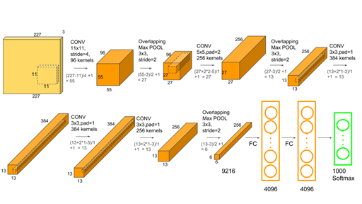
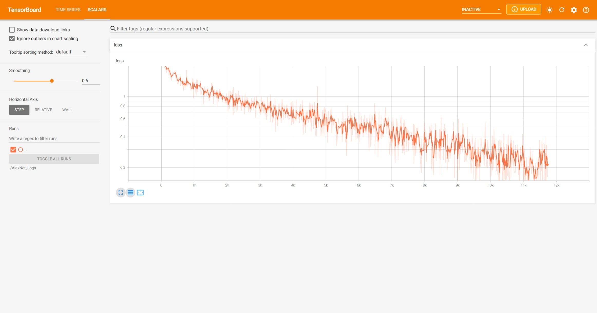
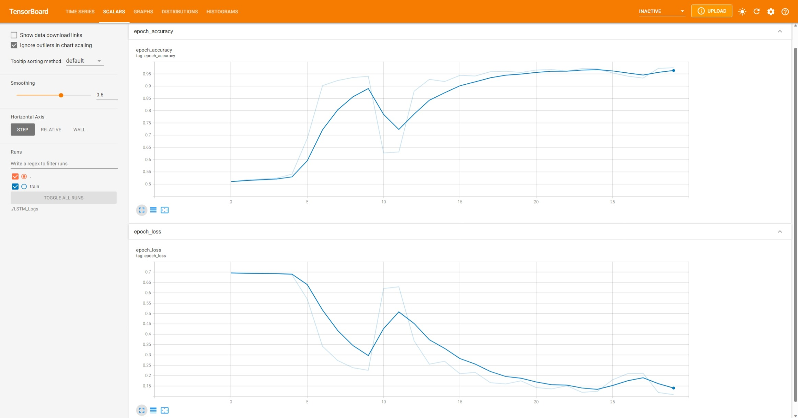

# 实验五：深度学习

> $author@Steven$

## 目录

* [实验五：深度学习](#实验五深度学习)
  * [目录](#目录)
  * [1. 卷积神经网络](#1-卷积神经网络)
    * [1.1 解题步骤](#11-解题步骤)
    * [1.2 结果分析](#12-结果分析)
  * [2. 循环神经网络](#2-循环神经网络)
    * [2.1 解题步骤](#21-解题步骤)
    * [2.2 结果分析](#22-结果分析)

## 1. 卷积神经网络

    本任务中你将使用深度学习库pytorch完成图像分类任务，搭建卷积神经网络的经典模型AlexNet，完成对cifar-10数据的分类任务，记录训练过程中的损失和准确率以及测试集的损失和准确率，并将其可视化，分析结果。
    文件夹cifar-10-batches-py包含我们的图像分类问题的数据集,data_batch_1,2..5为训练数据，test_batch为测试数据,为了方便图片转成张量，使用torchvision加载和处理数据集。图像加载预处理示例代码见ex5-1.py。
    模型细化结构如下图所示：
  

### 1.1 解题步骤

* 定义`class AlexNet`，继承`torch.nn.Model`，按照上图的结构在构造函数中定义模型结构。
* 数据预处理。由于`torchvision.datasets`中已有`CIFAR10`类，直接调用即可。
* 实例化`AlexNet`、优化器(使用Adam)、损失函数(使用交叉熵损失)。
* 预先定义一个`Tensorboard`的句柄。然后在for循环中训练模型，并在循环过程中将每次`epoch`的`loss`通过句柄传给`tensorboard`以便于可视化。

### 1.2 结果分析

* 
  * 随着迭代次数增加，交叉熵损失逐渐下降，最终保持在0.2左右，大致上是收敛了。

## 2. 循环神经网络

    本任务中你将深度学习工具tensorflow.keras完成中文文本的情感分析，搭建循环神经网络中的长短期记忆网络LSTM模型，使用keras提供的文本嵌入分词处理工具，完成对中文评论数据集的情感分析。将数据集留出30%作为测试集，记录训练过程的损失和准确率以及测试集的损失和准确率，并将其可视化，分析结果。
    文件comments.csv包含我们的中文评论的数据集，comments代表一条评论，label代表文本情感（好评/差评）。以及文本预处理的中文停等词文件chineseStopWord.txt。文本预处理示例代码见ex5-2.py。

### 2.1 解题步骤

* 数据预处理：读取数据，利用jieba将comments列拆分为词列表。
* 使用当前语料训练Word2Vec模型，并利用该模型将上述词列表转换为索引矩阵(索引为该模型中该词的索引)。
* 定义LSTM模型，划分测试集和训练集。
* 预先一个tensorboard的实例回调，然后在训练模型时将其添加到callback参数中，让tensorboard获取到数据源，以实现可视化。

### 2.2 结果分析

* 
  * 可以看出来随着epoch的增加，accuracy逐渐升高，loss逐渐降低，在20轮之后趋于稳定。Accuracy保持在95%以上，loss在0.15以下。
