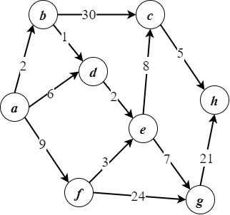

# 运筹学

> 这是上学期《最优化理论》课程的进阶课程，相较于上学期主要研究组合优化，这学期更多研究决策规划。
>
> 此外还是一门典型的人工智能的先修课，记得好好听课
>
> 但我学的不太好....汗

## 使用环境

* Windows 10
* Matlab R2022a
* Anaconda3(Based on Python 3.9.7)
* Microsoft Word（用于写实验报告）

## 教材

* [《运筹学基础及应用（第七版）》，胡运权 等著，高等教育出版社](https://book.douban.com/subject/35427625/)

## 目录

### [实验](./Experiments)

> 注意：此处的代码仅在测试用例上测试通过，未经过严格的测试，在求解其他题目时可能会出现计算错误，仅供参考。

* [实验1：单纯形法(Simplex Method)](./Experiments/Exp1/)
  * 代码：[`单纯形法.py`](./Experiments/Exp1/单纯形法.py)
  * 测试用例：[`线性规划_demo.md`](./Experiments/Exp1/线性规划_demo.md)
  * 实验报告：[Report.pdf](./Experiments/Exp1/Report.pdf)

* [实验2：对偶问题与对偶单纯形法(Dual simplex method)](./Experiments/Exp2/)
  * 代码
    * 功能函数：[`DualSimplexAlgorithm.m`](./Experiments/Exp2/DualSimplexAlgorithm.m)
    * 入口函数：[`script.m`](./Experiments/Exp2/script.m)
  * 测试用例：[`demo.md`](./Experiments/Exp2/demo.md)
  * 实验报告：[Report.pdf](./Experiments/Exp2/Report.pdf)

* [实验3：分支定界法(Branch and bound method)](./Experiments/Exp3/)
  * 代码：[`Branch.mlx`](./Experiments/Exp3/Branch.mlx)
    * > 这是Matlab即时编辑器文件，请使用Matlab打开
  * 实验报告：[Report.pdf](./Experiments/Exp3/Report.pdf)

* [实验4：Dijkstra算法](./Experiments/Exp4/)
  * 代码:[Dijkstra.py](./Experiments/Exp4/Dijkstra.py)
  * 测试用例：[`demo.drawio`](./Experiments/Exp4/demo.drawio)
    * 
  * 实验报告：[Report.docx](./Experiments/Exp4/Report.docx)
