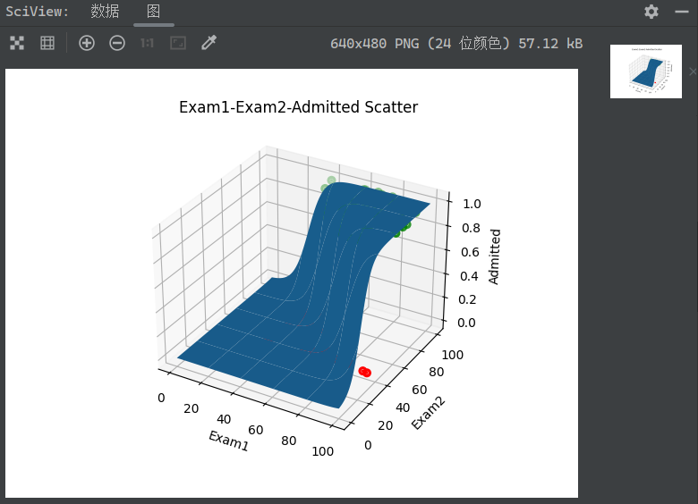

# 《机器学习》实验中的一些问题与技巧

> 这些问题和技巧主要与Python的特性相关。

## Matplotlib

### 1. `MatplotlibDeprecationWarning`

> 2023-03-10 记录

* 提示内容：
  * `MatplotlibDeprecationWarning: Support for FigureCanvases without a required_interactive_framework attribute was deprecated in Matplotlib 3.6 and will be removed two minor releases later.`
* 原因：
  * 较为新版的`matplotlib`支持并建议使用交互式绘图（类似于Matlab中，生成一个可交互的窗口Figure用于展示图片/模型并交互）
  * 此外，上文还提到将在Matplotlib 3.6的两个小版本更新后移除对于非交互式绘图的支持。
  * 但是，目前在网上找到的大多数教程都忽略了这一点，仍然抱着“能用就行，Warning无用”的态度因循守旧，这是非常偷懒的一种行为。
* 解决方法：
  * 启用交互式绘图只需要给matplotlib指定绘图后端即可，如下所示：

    ```python
    import matplotlib
    matplotlib.use('TkAgg')
    # 'TkAgg'使用的是Tkinter，Python自带GUI，免安装。也可以使用'Qt5Agg'，但是需要当前环境中已经安装PyQt5
    ```

* 效果展示
  * 非交互式绘图
    * 
  * TkAgg交互式绘图
    * 
  * PyQt5交互式绘图
    * 
  * 二者没有太大区别，但理论上PyQt5的性能应当优于Tkinter。

## graphviz

> graphviz是一个相较于Matplotlib性能更高的绘图工具(似乎叫引擎更合适)，唯一不好的一点是需要安装。

### 1. `graphviz.backend.ExecutableNotFound`

> 2023-03-27 记录

## pandas

### 1. `UserWarning`

* 提示内容：
  * `UserWarning: X does not have valid feature names, but * was fitted with feature names`
* 原因：
  * 在使用机器学习/深度学习相关库时，由于Python本身弱数据类型的特点以及`pandas`、`numpy`和`matplotlib`三者之间良好的兼容性，我们经常会忽视掉数据类型的问题，但这个问题就是因为数据类型的差异导致的。
  * 这个Warning的意思是某个变量`X`没有`feature names`，但你调用的某个模型却是根据有`feature names`的数据训练的。
  * 这个问题经常出现在机器学习中，比如使用`sklearn`训练模型时，数据直接使用了`pandas`的`DataFrame`类型，但之后的一些运算(如`sklearn.svm.SVC.score()`)的输入却是`numpy.ndarray`类型，这就导致了这个Warning。
  * 不过注意到，这个问题只是一个Warning，并不会影响程序的运行，但即使这样，放任Warning也是个很不好的习惯。
* 解决方法：
  * 很简单，只需要在数据预处理的过程中额外添加一步，将`DataFrame`转换为`numpy.ndarray`，(通常直接套一个`numpy.array()`即可)。
    * > 不建议将`numpy.ndarray`转换为`DataFrame`，因为`DataFrame`中有`feature name`属性，这么转换会增加很多无谓的麻烦。
